# 🏘️ MahalleUstasiApp: Yerel Hizmet Profesyonelleri Platformu

MahalleUstasiApp, yerel hizmet profesyonellerini (Ustalar) ve hizmet arayan mahalle sakinlerini buluşturan, modern ve ölçeklenebilir bir Android mobil uygulamasıdır. Proje, Jetpack Compose, MVVM, Hilt ve Firebase gibi güncel teknolojileri kullanarak, güvenilir hizmet arayışını ve sunumunu kolaylaştıran bir platform sunar.

## 💡 Proje Vizyonu ve Genel Bakış

Projenin temel vizyonu, mahalle kültüründeki güvenilir "usta-komşu" ilişkisini dijital ortama taşıyarak, hizmet arama ve sunma süreçlerindeki belirsizlikleri ve zaman kaybını ortadan kaldırmaktır. Uygulama, hem iş sahiplerine hem de ustalara yönelik iki ana kullanıcı akışına sahiptir.

## ✨ Temel Özellikler

| Kategori | Özellik | Kullanıcı Değeri |
|----------|---------|-------------------|
| Kullanıcı Yönetimi | Güvenli Kimlik Doğrulama | Firebase Auth ile E-posta/Şifre tabanlı, güvenli ve hızlı giriş/kayıt. |
| İş Akışı | Detaylı İş İlanı Oluşturma | Fotoğraf ve Google Haritalar entegrasyonu ile konum bazlı, kategorize edilmiş iş talepleri. |
| İletişim | Gerçek Zamanlı Teklif ve Sohbet | Ustaların teklif sunması, iş sahiplerinin değerlendirmesi ve kabul sonrası anlık sohbet imkanı. |
| Güvenilirlik | Usta Profilleri ve Derecelendirme | Ustaların geçmiş işlerine ait yorum ve puanlamaları içeren şeffaf profiller. |
| Bildirim | Anlık Push Bildirimleri (FCM) | Yeni teklifler, mesajlar ve iş durumu değişiklikleri hakkında anında bilgilendirme. |
| Konum | Google Haritalar Entegrasyonu | İşin tam konumunu harita üzerinde işaretleme ve ustaların yakındaki işleri görmesi. |

## 🛠️ Teknoloji Yığını (Tech Stack)

Uygulama, performans, sürdürülebilirlik ve modernite odaklı bir teknoloji yığını ile geliştirilmiştir.

### Mobil Geliştirme (Android)

- **Dil:** Kotlin
- **UI Framework:** Jetpack Compose (Material3)
- **Mimari:** MVVM (Model-View-ViewModel)
- **Bağımlılık Enjeksiyonu:** Hilt
- **Asenkron Programlama:** Kotlin Coroutines & Flow
- **Navigasyon:** Compose Navigation
- **Haritalar:** Google Maps SDK for Android (Maps Compose)
- **Görsel İşleme:** Coil (Görsel yükleme ve önbellekleme)

### Backend ve Veri Yönetimi (BaaS)

- **Platform:** Firebase
- **Authentication:** Kullanıcı oturum yönetimi
- **Veritabanı:** Firestore (NoSQL, gerçek zamanlı veri senkronizasyonu)
- **Depolama:** Firebase Storage (Görsel ve dosya barındırma)
- **Bildirimler:** Firebase Cloud Messaging (FCM)

## 🏗️ Mimari Tasarım: MVVM, Hilt ve Veri Akışı

Proje, temiz kod prensiplerini destekleyen MVVM mimarisi üzerine kurulmuştur ve Hilt ile bağımlılık yönetimi sağlanır.

### 🔹 MVVM Katmanları ve Veri Akışı

1. **View (Compose UI):** Kullanıcı arayüzünü oluşturur. ViewModel'den gelen State'i dinler ve kullanıcı etkileşimlerini ViewModel'e iletir.
2. **ViewModel:** UI'ın durumunu yönetir (StateFlow, SharedFlow kullanarak) ve iş mantığını tetikler. Repository'den veri ister ve UI'a sunar.
3. **Repository:** Veri kaynakları (Firestore, Storage) ile iletişim kurar. Firestore'dan gelen veriler, Kotlin Flow'lar aracılığıyla ViewModel'e iletilir. Bu katman, veri dönüşümlerini ve hata yönetimini de üstlenir.

### 🔹 Bağımlılık Enjeksiyonu (Hilt)

Hilt, Application, Activity, ViewModel gibi Android bileşenlerine bağımlılıkları kolayca enjekte etmek için kullanılır. Bu, test edilebilirliği ve kodun okunabilirliğini artırır.

### 🔹 Asenkron Akış Yönetimi (Coroutines & Flow)

- **Coroutines:** Tüm uzun süren işlemler (Firebase çağrıları, I/O işlemleri) Coroutines ile yönetilir.
- **Flow:** Özellikle Firestore'dan gelen gerçek zamanlı güncellemeler (örneğin yeni bir teklif geldiğinde) Flow ile dinlenir ve UI'a reaktif bir şekilde yansıtılır.

## 🗂️ Proje Yapısı (Önemli Klasörler)
```
MahalleUstasiApp/
├─ app/
│  ├─ src/main/java/com/example/mahalleustasi/
│  │  ├─ data/          # Repository'ler, Veri Modelleri (Entity/DTO) ve Veri Kaynakları
│  │  ├─ di/            # Hilt modülleri (AppModule, FirebaseModule vb.)
│  │  ├─ domain/        # İş mantığı (Use Case'ler)
│  │  ├─ ui/            # Jetpack Compose ekranları (View)
│  │  │  ├─ home/
│  │  │  ├─ job_detail/
│  │  │  └─ ...
│  │  ├─ viewmodel/     # ViewModel'ler (State ve Event yönetimi)
│  │  └─ util/          # Yardımcı sınıflar ve uzantılar
├─ functions/           # Firebase Cloud Functions (Bildirimler, Arka Plan İşlemleri)
├─ build.gradle.kts     # Proje seviyesi Gradle dosyası
└─ README.md            # Buradasınız
```

## 🔒 Firebase Güvenlik Kuralları (Örnek)

Uygulamanın güvenliği için Firestore ve Storage kuralları, kullanıcı rollerine ve sahiplik durumuna göre sıkı bir şekilde yapılandırılmıştır.
```javascript
// Firestore Güvenlik Kuralları Örneği
rules_version = '2';
service cloud.firestore {
  match /databases/{database}/documents {
    // Kullanıcı sadece kendi profilini okuyabilir ve yazabilir
    match /users/{userId} {
      allow read, write: if request.auth != null && request.auth.uid == userId;
    }
    // İş ilanları (jobs) herkes tarafından okunabilir, ancak sadece işi oluşturan güncelleyebilir/silebilir
    match /jobs/{jobId} {
      allow read: if true;
      allow create: if request.auth != null;
      allow update, delete: if request.auth.uid == resource.data.ownerId;
    }
    // Teklifler (offers) sadece ilgili işin sahibi veya teklifi veren usta tarafından okunabilir
    match /jobs/{jobId}/offers/{offerId} {
      allow read: if request.auth.uid == get(/databases/$(database)/documents/jobs/$(jobId)).ownerId || request.auth.uid == resource.data.professionalId;
      allow create: if request.auth != null;
    }
  }
}
```

## 🚀 Kurulum ve Çalıştırma

Projeyi yerel makinenizde çalıştırmak için aşağıdaki adımları takip edin.

### ✅ Ön Gereksinimler

- Android Studio (Hedgehog | 2023.1.1 veya daha yenisi)
- JDK 17
- Bir Firebase projesi
- Bir Google Maps API Anahtarı
- firebase-cli (Cloud Functions için)

### Kurulum Adımları

1. **Depoyu Klonlayın:**
```shell
git clone https://github.com/Faruk-Aydn/MahalleUstasiApp.git
cd MahalleUstasiApp
```

2. **Firebase Yapılandırması:**
   - Firebase Console üzerinden yeni bir proje oluşturun.
   - `com.example.mahalleustasi` paket adıyla bir Android uygulaması ekleyin.
   - Oluşturulan `google-services.json` dosyasını projenin `app/` dizinine yerleştirin.
   - Firebase'de Authentication (E-posta/Şifre), Firestore ve Storage servislerini etkinleştirin.

3. **Google Haritalar API Anahtarı:**
   - Google Cloud Console üzerinden bir API Anahtarı alın ve "Maps SDK for Android" servisini etkinleştirin.
   - API anahtarınızı `local.properties` dosyasına aşağıdaki gibi ekleyin:
```
MAPS_API_KEY=sizin_api_anahtarınız
```

4. **Derleme ve Çalıştırma:**
   - Projeyi Android Studio'da açın.
   - Gradle senkronizasyonunu yapın.
   - Emülatörde veya fiziksel cihazda çalıştırın.

## 📸 Ekran Görüntüleri (Screenshots)

<div align="center">

### Giriş ve Ana Ekranlar
<p>
  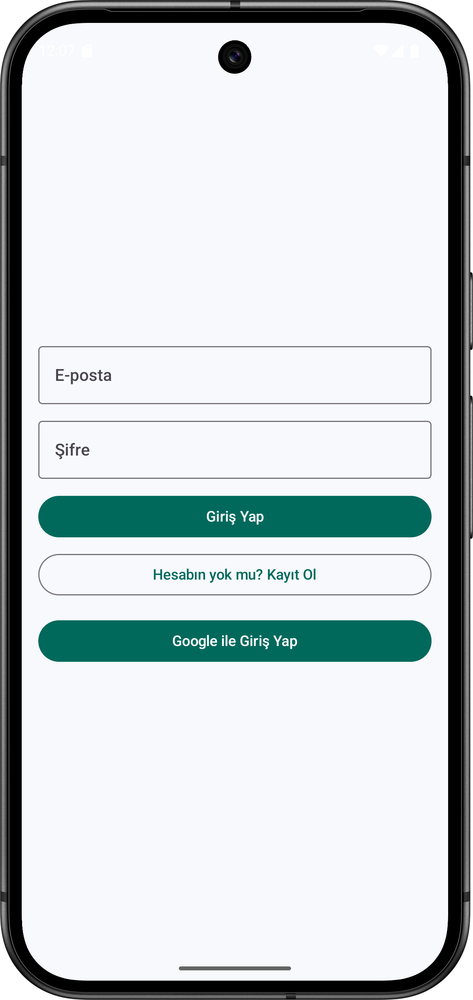
  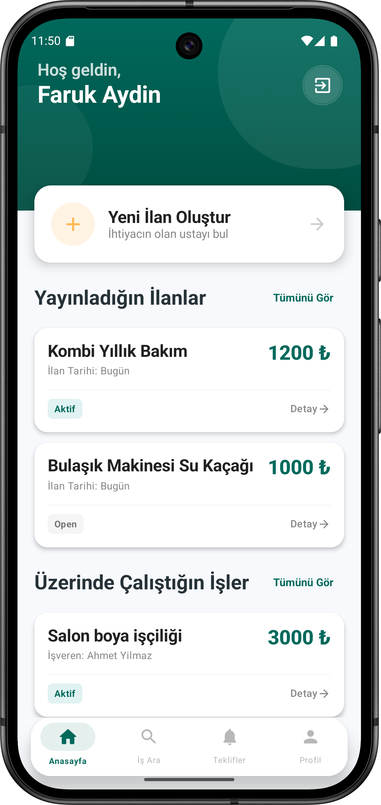
  
</p>

### İş Detayları ve İşlemler
<p>
  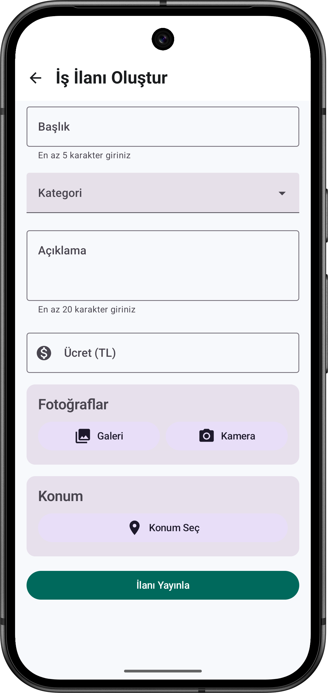
  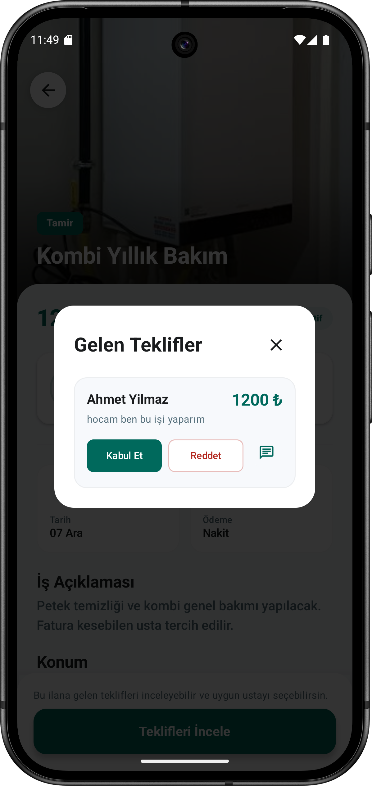
  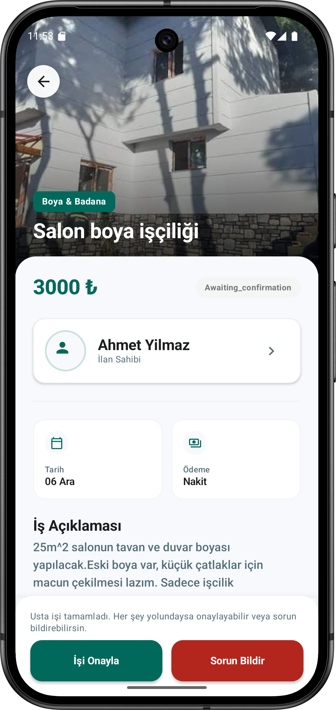
</p>

### Profil ve İletişim
<p>
  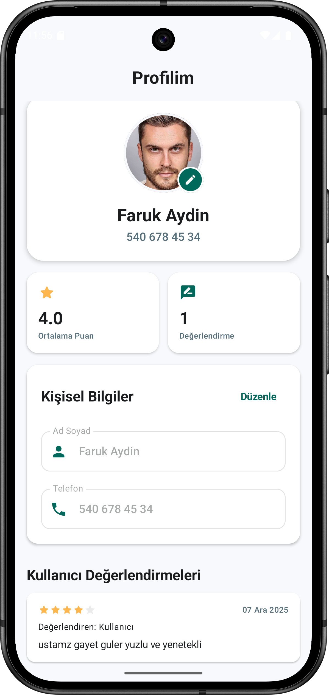
  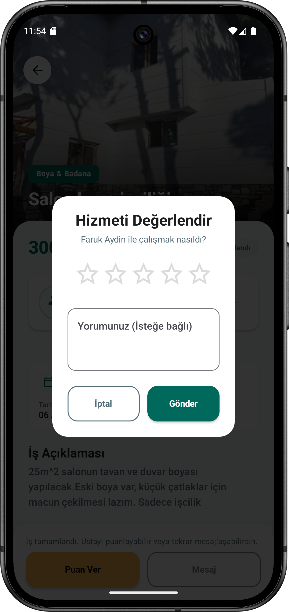
  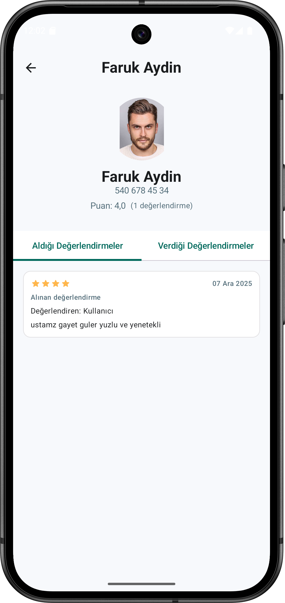
</p>

### Mesajlaşma ve Teklifler
<p>
  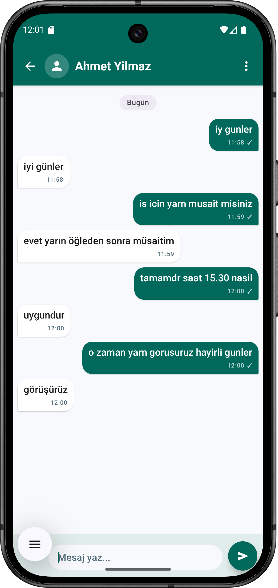
  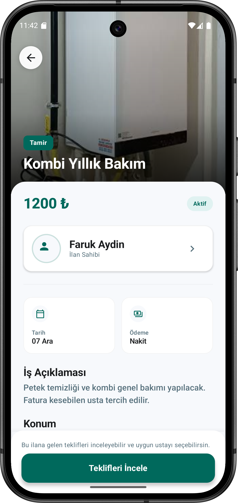
  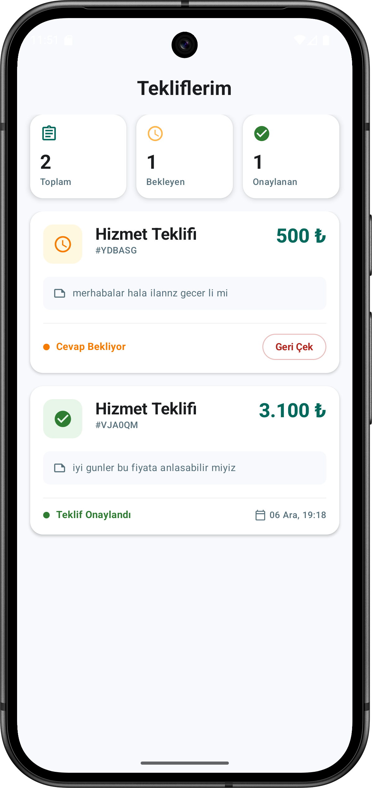
</p>

</div>

## 🤝 Katkıda Bulunma

Projenin geliştirilmesine katkıda bulunmaktan memnuniyet duyarız. Lütfen bir özellik eklemeden veya büyük bir değişiklik yapmadan önce bir Issue açarak niyetinizi belirtin.

1. Projeyi Fork'layın.
2. Yeni bir özellik dalı oluşturun (`git checkout -b feature/yeni-ozellik`).
3. Değişikliklerinizi Commit'leyin (`git commit -m 'feat: Yeni özellik eklendi'`).
4. Dalınıza Push yapın (`git push origin feature/yeni-ozellik`).
5. Bir Pull Request (Çekme İsteği) açın.

## 📄 Lisans

This project is licensed under the MIT License - see the [LICENSE](LICENSE) file for details.

## 📞 İletişim

**Faruk Aydın** - farukaydin8245@gmail.com

**Proje Bağlantısı:** https://github.com/Faruk-Aydn/MahalleUstasiApp

